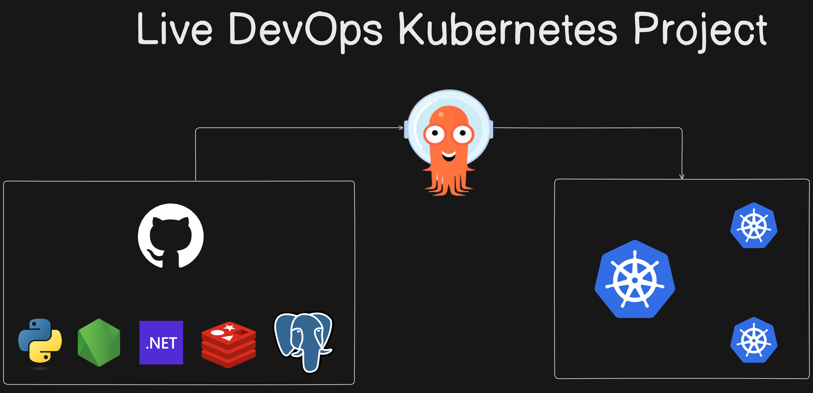
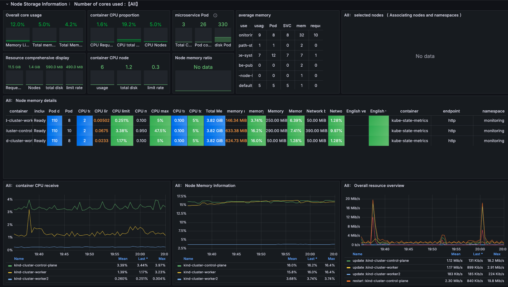
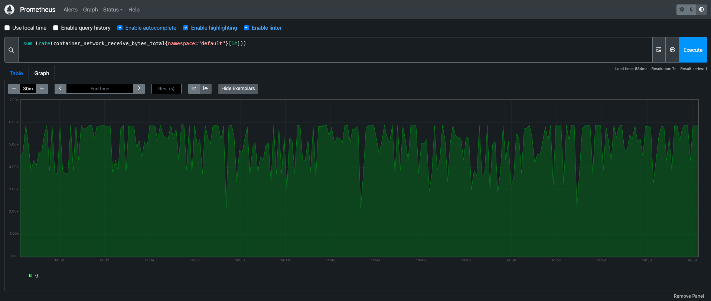

# K8s Kind Voting App

* A front-end web app in [Python](/vote) which lets you vote between two options
* A [Redis](https://hub.docker.com/_/redis/) which collects new votes
* A [.NET](/worker/) worker which consumes votes and stores them in…
* A [Postgres](https://hub.docker.com/_/postgres/) database backed by a Docker volume
* A [Node.js](/result) web app which shows the results of the voting in real time

## Run the App
```bash

cd k8s-specifications
kubectl apply -f .
kubectl get pods
kubectl get svc

kubectl port-forward svc/vote 5000:5000 --address=0.0.0.0 
kubectl port-forward svc/result 5001:5001 --address=0.0.0.0 

```

## Architecture



## Observability




