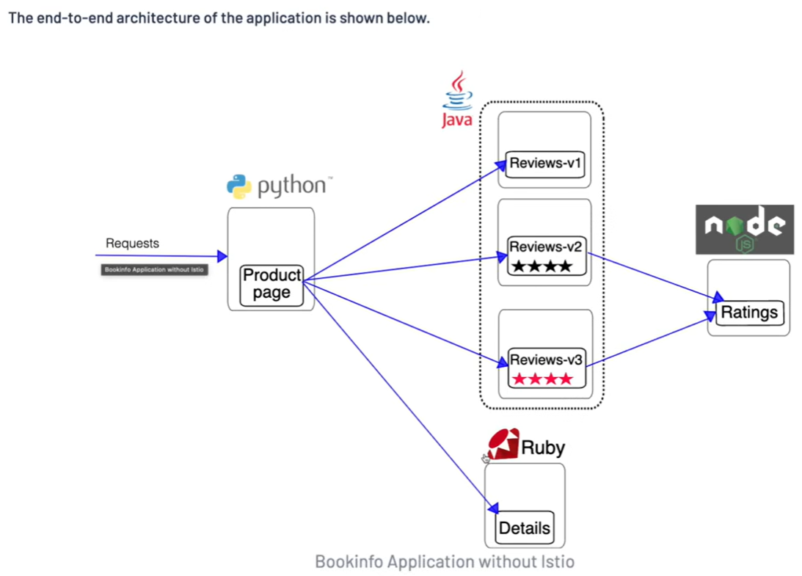
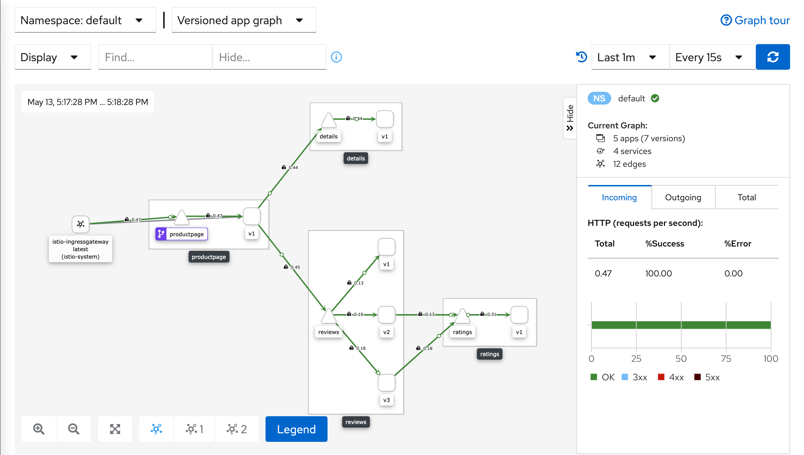

# Service Mesh with Istio

> Concepts, architecture, capabilities, and practical Kubernetes commands for learning Istio.

[](https://istio.io/)
[](https://kubernetes.io/)



## Contents

- [What is a service mesh?](#what-is-a-service-mesh)
- [Why use Istio?](#why-use-istio)
- [Istio architecture](#istio-architecture)
- [Core capabilities](#core-capabilities)
- [Istio deployment modes](#istio-deployment-modes)
- [Practical lab: Bookinfo](#practical-lab-bookinfo)
- [References](#references)

## What is a service mesh?

A **service mesh** is a dedicated infrastructure layer that manages communication between services in a distributed application. It moves common networking concerns out of application code and into a consistent platform layer.

A service mesh can provide:

- service-to-service security and identity;
- traffic routing, retries, timeouts, and load balancing;
- resilience features such as circuit breaking and fault injection;
- metrics, logs, and distributed traces for service communication;
- consistent policy enforcement across teams and services.

The application still uses the Kubernetes network. A service mesh is **not** an overlay network. Instead, it observes and controls traffic as it moves through the application.

### Without a service mesh

Each service or client library must implement networking behavior independently. This often leads to duplicated configuration, inconsistent security, and limited visibility into failures.

### With a service mesh

The mesh provides a standard communication layer. Application services can focus on business logic while the mesh handles service discovery, secure connections, traffic policies, and telemetry.

## Why use Istio?

[Istio](https://istio.io/latest/docs/concepts/what-is-istio/) is an open-source service mesh designed for Kubernetes and other cloud-native environments. It integrates with Kubernetes resources and provides a uniform way to manage traffic, security, policies, and telemetry across microservices.

Istio is useful when an application needs:

- encrypted and authenticated service-to-service communication with mutual TLS;
- gradual releases such as canary deployments and traffic shifting;
- visibility into request rates, latency, errors, and service dependencies;
- resilience controls without changing every application;
- centralized configuration and certificate management.

Istio is most valuable for applications with many services or teams. For a small application, the operational cost of installing and managing a mesh may be greater than the benefit.

## Istio architecture

Istio has a **data plane** and a **control plane**.

### Data plane

The data plane carries application traffic. In sidecar mode, an Envoy proxy runs beside each selected workload. Incoming and outgoing requests pass through the proxy, allowing Istio to apply routing, security, and telemetry configuration without modifying the application.

### Control plane

The control plane configures the data plane and manages mesh-wide behavior. The primary control-plane component is **Istiod**, which combines:

- service discovery and proxy configuration;
- certificate issuance and rotation;
- validation and distribution of Istio configuration.

### Main components

| Component | Plane | Responsibility |
| --- | --- | --- |
| **Envoy** | Data plane | Proxies workload traffic and provides routing, security, resilience, and telemetry features. |
| **Istiod** | Control plane | Discovers services, translates configuration, configures proxies, and manages certificates. |
| **Ztunnel** | Data plane | Lightweight Rust proxy used by Ambient mode for secure connectivity and basic observability without sidecars. |
| **istioctl** | Administration | CLI for installing Istio, validating configuration, inspecting proxies, and opening dashboards. |
| **Kiali** | Observability | Optional dashboard for viewing service graphs, workloads, traffic, and configuration. |

## Core capabilities

### Traffic management

Istio can route traffic using request attributes such as host, path, headers, or workload version. This supports:

- blue-green and canary releases;
- weighted traffic splitting;
- retries, timeouts, and connection pools;
- circuit breakers and outlier detection;
- controlled fault injection for testing resilience.

Traffic behavior is configured with resources such as `VirtualService` and `DestinationRule`.

### Security

Istio can provide workload identity and mutual TLS between services. This allows the mesh to encrypt traffic and authenticate the workloads communicating with one another. `PeerAuthentication`, `AuthorizationPolicy`, and `RequestAuthentication` are commonly used to define security behavior.

### Observability

The proxies generate telemetry about requests flowing through the mesh, including request volume, latency, error rates, and service dependencies. Istio can export this data to tools such as Prometheus, Grafana, Jaeger, and Kiali.

### Policy and configuration

Istio applies mesh configuration consistently through Kubernetes custom resources. This keeps traffic and security behavior declarative, reviewable, and version-controlled.

## Istio deployment modes

### Sidecar mode

A proxy is injected into each selected pod. This mode provides the broadest feature set and is enabled in a namespace with a label such as:

```bash
kubectl label namespace default istio-injection=enabled
```

Pods must be recreated after labeling so that the proxy is injected into newly created pods.

### Ambient mode

Ambient mode uses node-level components, including Ztunnel, to provide mesh functionality without adding a sidecar container to every pod. Workloads can be enrolled in the ambient data plane incrementally. Ambient mode can reduce per-pod overhead, while waypoint proxies provide advanced Layer 7 features where needed.

## Practical lab: Bookinfo

The following commands demonstrate Istio with the [Bookinfo sample application](https://istio.io/latest/docs/examples/bookinfo/). They are intended for a test or learning cluster.

### Prerequisites

- A running Kubernetes cluster and configured `kubectl` context.

Verify cluster access:

```bash
kubectl cluster-info
kubectl get nodes
```

### Install Istio

Download Istio and add `istioctl` (like kubectl) to your `PATH`:

```bash
curl -L https://istio.io/downloadIstio | sh -
cd istio-<version>
ls
cd bin
./istioctl

sudo mv istioctl /usr/local/bin
OR
export PATH="$PWD/bin:$PATH"

istioctl version
cd ..
```

Install the demo profile and enable automatic sidecar injection for the `default` namespace:

```bash
istioctl install -f samples/bookinfo/demo-profile-no-gateways.yaml -y
kubectl label namespace default istio-injection=enabled --overwrite
```
Expected output:
```text
namespace/default labeled
```

Verify
```bash
kubectl get namespace -L istio-injection
```

### Install the Gateway API

Install the Gateway API CRDs if they are not already available:

```bash
kubectl get crd gateways.gateway.networking.k8s.io &> /dev/null || \
{ kubectl kustomize "github.com/kubernetes-sigs/gateway-api/config/crd?ref=v1.5.1" | kubectl apply -f -; }
```

### Deploy and verify Bookinfo

```bash
kubectl apply -f samples/bookinfo/platform/kube/bookinfo.yaml
kubectl rollout status deployment --all
kubectl get all
```

Each Bookinfo pod should have two containers: the application container and its injected Envoy proxy. Test the application from inside the cluster:

```bash
kubectl exec "$(kubectl get pod -l app=ratings -o jsonpath='{.items[0].metadata.name}')" \
  -c ratings -- curl -sS productpage:9080/productpage | grep -o "<title>.*</title>"
```

Expected output:

```text
<title>Simple Bookstore App</title>
```

### Expose Bookinfo with the Gateway API

```bash
kubectl apply -f samples/bookinfo/gateway-api/bookinfo-gateway.yaml
```
Expected output:
```text
gateway.gateway.networking.k8s.io/bookinfo-gateway created
httproute.gateway.networking.k8s.io/bookinfo created
```

Change the service type to ClusterIP by annotating the gateway:
```bash
kubectl annotate gateway bookinfo-gateway \
  networking.istio.io/service-type=ClusterIP --namespace=default
```
Expected output:
```text
gateway.gateway.networking.k8s.io/bookinfo-gateway annotated
```

```bash
kubectl get gateway
```
Expected output:
```text
NAME               CLASS   ADDRESS                                            PROGRAMMED   AGE
bookinfo-gateway   istio   bookinfo-gateway-istio.default.svc.cluster.local   True         26s
```

When the gateway reports `PROGRAMMED: True`, forward it locally:

```bash
kubectl port-forward svc/bookinfo-gateway-istio 8080:80 &
```
Expected output:
```text
Forwarding from 127.0.0.1:8080 -> 80
Forwarding from [::1]:8080 -> 80
```

Verify the Envoy response:
```bash
curl -I http://localhost:8080/productpage
```
Expected output:
```text
HTTP/1.1 200 OK
server: istio-envoy
```

Create an SSH tunnel using Step 4.5 of the [KIND cluster README](../../KIND_Cluster_Install/README.md).

Use below in Step 4.5.4
```bash
ssh -i ~/.ssh/id_rsa -L 9090:localhost:8080 VM_Username@VM_IP
```

Open [http://localhost:9090/productpage](http://localhost:9090/productpage) on the local machine.


### View the mesh in Kiali (The Dashboard)

```bash
kubectl apply -f samples/addons/kiali.yaml
kubectl rollout status deployment/kiali -n istio-system
```
Expected output:
```text
Waiting for deployment "kiali" rollout to finish: 0 of 1 updated replicas are available...
deployment "kiali" successfully rolled out
```

```bash
kubectl port-forward -n istio-system svc/kiali 20001:20001
```
Expected output:
```text
Forwarding from 127.0.0.1:20001 -> 20001
Forwarding from [::1]:20001 -> 20001
```

Create an SSH tunnel using Step 4.5 of the [KIND cluster README](../../KIND_Cluster_Install/README.md).


Use below in Step 4.5.4
```bash
ssh -i ~/.ssh/id_rsa -L 20001:localhost:20001 VM_Username@VM_IP
```

Open [http://localhost:20001/kiali](http://localhost:20001/kiali).

### Generate traffic

Send requests so Kiali can display service relationships and telemetry:

```bash
for i in $(seq 1 100); do
  curl -s -o /dev/null "http://localhost:8080/productpage"
done
```

Explore the **Graph**, **Applications**, and **Workloads** views in Kiali.



### Remove the sample resources

```bash
kubectl delete -f samples/bookinfo/gateway-api/bookinfo-gateway.yaml
kubectl delete -f samples/bookinfo/platform/kube/bookinfo.yaml
```

## References

- [Istio: What is Istio?](https://istio.io/latest/docs/concepts/what-is-istio/)
- [Istio getting started guide](https://istio.io/latest/docs/setup/getting-started/)
- [Istio traffic management](https://istio.io/latest/docs/concepts/traffic-management/)
- [Bookinfo sample application](https://istio.io/latest/docs/examples/bookinfo/)
- [Kubernetes Gateway API](https://gateway-api.sigs.k8s.io/)
